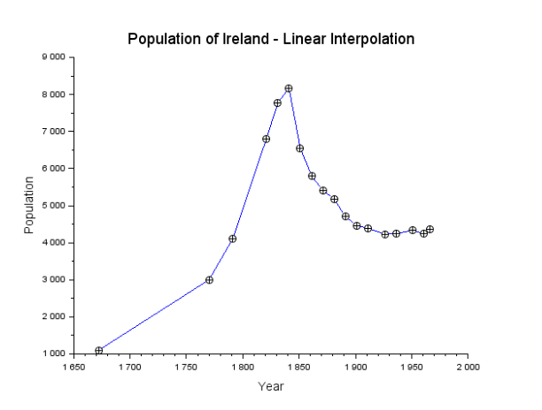
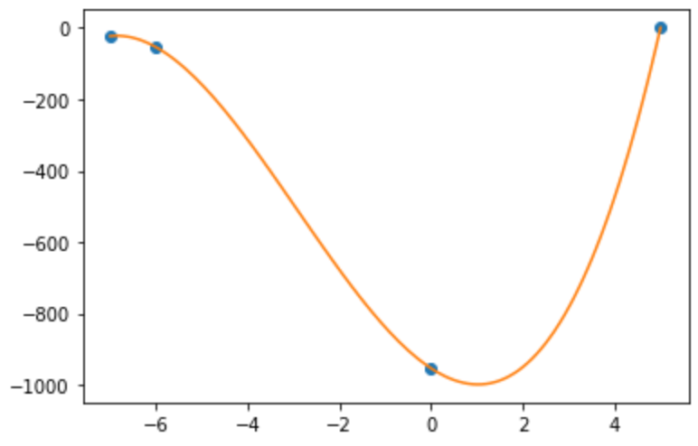
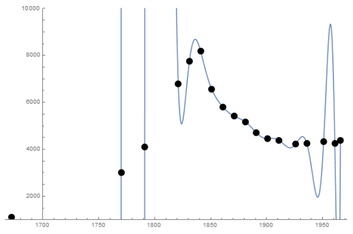
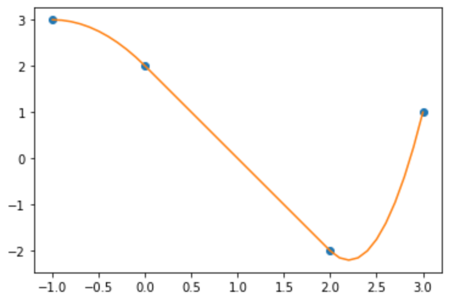

## Introduction

In the lecture, you have seen the method of curve fitting using least-square linear regression. This idea can be used not only to fit lines, but also to fit non-linear functions through "feature engineering" of some nonlinear bases. In this writeup, I will present some alternative ways to perform curve fitting in mathematical modelling, using *interpolation*.

The idea of interpolation is that, supposing we similarly have data points $$(x_0, y_0), (x_1, y_1), \dots, (x_n, y_n)$$, we will construct a function $$f$$ such that $$f(x_0) = y_0$$, $$f(x_1) = y_1$$, $$\dots$$, $$f(x_n) = y_n$$, meaning we want to force this curve to pass through all our known data points. Then, this function can allow us to predict an approximate value of $$y$$ for some $$x$$ in between.

## Linear Interpolation

The most straightforward method is linear interpolation, where we simply join each two consecutive data points using a straight line segment. For example, a linear interpolation of the population of Ireland looks as follows:

{:.image-caption}
Figure 1: Curve fitting for the population of Ireland using linear interpolation

Notice that there is not a single equation that defines this curve. Instead, there is a different equation for each interval. For each interval from $$x_i$$ to $$x_{i+1}$$, we join $$(x_i, y_i)$$ with $$(x_{i+1}, y_{i+1})$$. Therefore, the equation of this part is given by $$f(x) = y_i + \frac{y_{i+1} - y_{i}}{x_{i+1} - x_{i}} (x - x_i)$$.

Another problem with linear interpolation is that the curve is not *smooth*—we see sharp changes of slopes at each known data point.

## Polynomial Interpolation

Let us take a step back here. If we want to find a curve that perfectly crosses our $$n$$ points, why don't we simply set an polynomial of degree $$n$$ and solve for the coefficients? If we have 2 points, we can use a straight line to join them; if we have 3 points, we can use a parabola; if we have 4 points, we can use the curve of a cubic function; etc.

Instead of having to solve the coefficients, we even have a closed-form interpolating polynomial in *Lagrange form*, given by   
$$
    p(x) = y_0 \ell_0(x) + y_1 \ell_1(x) + \cdots + y_n \ell_n(x),
$$

where   
$$
    \ell_i(x) = \frac{x - x_0}{x_i - x_0} \cdot \frac{x - x_1}{x_i - x_1} \cdots \frac{x - x_{i-1}}{x_i - x_{i - 1}} \cdot \frac{x - x_{i+1}}{x_i - x_{i+1}} \cdots \frac{x - x_n}{x_i - x_n}
$$

is called the *cardinal function*. Notice that $$\frac{x - x_i}{x_i - x_i}$$ is skipped.

This equation looks very scary, but let me illustrate it with an example. Suppose we have $$(x_0, y_0) = (5, 1)$$, $$(x_1, y_1) = (-7, -23)$$, $$(x_2, y_2) = (-6, -54)$$, and $$(x_3, y_3) = (0, -954)$$. Then, the Lagrange interpolating polynomial is   
$$
    p(x) = 1 \ell_0(x) - 23 \ell_1(x) - 54 \ell_2(x) - 954 \ell_3(x),
$$

where   
$$\ell_0 = \frac{x + 7}{5 + 7} \cdot \frac{x + 6}{5 + 6} \cdot \frac{x - 0}{5 - 0}$$,   
$$\ell_1 = \frac{x - 5}{-7 - 5} \cdot \frac{x + 6}{-7 + 6} \cdot \frac{x - 0}{-7 - 0}$$,   
$$\ell_2 = \frac{x - 5}{-6 - 5} \cdot \frac{x + 7}{-6 + 7} \cdot \frac{x - 0}{-6 - 0}$$, and   
$$\ell_3 = \frac{x - 5}{0 - 5} \cdot \frac{x + 7}{0 + 7} \cdot \frac{x + 6}{0 + 6}$$.

Let us first see what happens with the $$x$$'s in our given data. For example, let $$x = x_1 = -7$$. Notice that the cardinal functions $$\ell_0$$, $$\ell_2$$, and $$\ell_3$$ will be $$0$$ because they each have a factor $$(x+7)$$. However, $$\ell_1 = 1$$ exactly because the $$(x - x_i)$$ factor is skipped by definition. Then, $$p(x) = 0 - 23 \times 1 - 0 - 0 = -23 = y_1$$, as expected.

A plot of this curve is shown in Figure 2.

{:.image-caption}
Figure 2: Example of Lagrange interpolation

But, do you see a problem here? Our data is actually fluctuating significantly. When the degree increases, fluctuations become even more serious, especially near the end of each interval. This is known as the **Runge phenomenon**. Figure 3 shows an Lagrange interpolation of 18 data points, with tremendous fluctuation. Such wild fluctuations can easily make the curve not meaningful anymore.

{:.image-caption}
Figure 3: The Runge phenomenon

## Spline

A nice balance between the piecewise linear interpolation and the Lagrange interpolation is the *spline* method. Similar to linear interpolation, we would define a function for each interval. But, we will use higher-order polynomials and enforce that the curve remains smooth at the data points. How can we do that? We can add a constraint that the derivative are the same on both sides of each data point—because we now have more unknowns in our functions!

For example, given three data points $$(x_0, y_0) = (-1, 3)$$, $$(x_1, y_1) = (0, 2)$$, $$(x_2, y_2) = (2, -2)$$, and $$(x_3, y_3) = (3, 1)$$, let's use polynomials of degree 2 so that   
$$
    f(x) = \begin{cases} p_1(x) = a_1 + b_1 x + c_1 x^2 & (-1 \leq x \leq 0), \\ p_2(x) = a_2 + b_2 x + c_2 x^2 & (0 \leq x \leq 2), \\ p_3(x) = a_3 + b_3 x + c_3 x^2 & (2 \leq x \leq 3). \end{cases}
$$

We want them to pass through our known data points, and also enforce smoothness by setting $$p_1^\prime (x_1) = p_2^\prime (x_1)$$ and $$p_2^\prime(x_2) = p_3^\prime(x_2)$$. And usually, we would artificially set $$p_1^\prime(x_0) = 0$$. Now we have 9 equations to solve the 9 unknowns. There are some nice tricks to solve this huge system of equations that I will not dive into, but the final curve we would get is   
$$
    f(x) = \begin{cases} 
    p_1(x) = 2 - 2x - x^2 & (-1 \leq x \leq 0), \\ p_2(x) = 2 - 2x & (0 \leq x \leq 2), \\ p_3(x) = 22 - 22x + 5x^2 & (2 \leq x \leq 3). \end{cases}
$$

The curve derived is shown in the following graph. Notice the smooth transition at each data point.

{:.image-caption}
Figure 4: Curve derived using spline

Such a spline function is called the natural quadratic spline. In real life, we more frequently use cubic spline, where we would use cubic functions and add similar constraints on second derivatives.

## Concluding Remarks

Regression and interpolation are two major techniques of curve fitting. You have seen the least square regression in the lecture, and here we have seen some techniques of interpolation. Unlike regression, interpolation gives curves that adhere completely to the observed data points. However, it can easily "overfit" and is sensitive to fluctuations in the data points themselves. But this might still be preferred when there is not any prior knowledge on a form we could use for regression or when the form is already way too complicated. Also, interpolation does not naturally give us predictions for data outside the range of our observed data (i.e., below the minimum or above the maximum). To make predictions for such values, we have to perform *extrapolation* perhaps based on some assumptions such as that the trend of the last piece of interpolated polynomial will continue. We have to exercise great caution here, since the behaviour may perfectly not be what we desire beyond the range.

## References

A large part of the concepts and examples presented here comes from the material of the course Mathematical Laboratory and Modeling by Dr. Chi Wing Wong at the University of Hong Kong, where I was a visiting student in the summer of 2018. For those of you interested in mathematical modeling, there is also a nice book *A First Course in Mathematical Modeling* by Frank R. Giordano et al., for your reference.