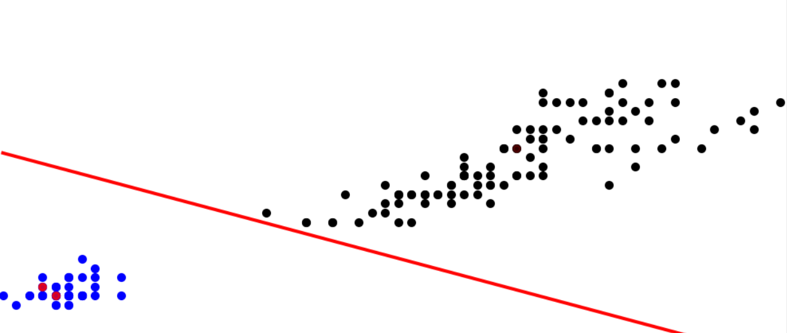

## Introduction

In this final write-up I have for this semester, we will have a brief look at a popular topic today—machine learning—and how some linear algebra comes into play there! I will show two simple techniques of machine learning: nearest neighbours and perceptron.

## Preprocessing: Making All Things Matrices and Vectors

The very first but crucial step we need to take before feeding anything into any of our fancy machine learning models is to represent clean up and process the data so that they would be in a format that can be understood by the machine. Often, we will make the data set a matrix, where each row represents an "instance" and each column describes one "feature".

A classic example is the "Iris flower data set". This data set appeared in the paper *The use of multiple measurements in taxonomic problems* by the British statistician and biologist Ronald Fisher [1] and is now frequently used as a typical test case or example for statistical classification techniques [2]. It records the lengths and widths of the sepals and petals respectively (so 4 *features*) in centimeters for 150 iris flowers (*instances*) that can be classified into 3 species (*classes*): *Iris setosa*, *Iris virginica*, and *Iris versicolor*. Then, we can construct a matrix with 150 rows each representing one flower and 4 columns each representing a feature. Each row will be *labelled* which species of iris it corresponds to.

Another common example is for images. In my second write-up for this semester [3], I talked about how images are represented in computers, namely by individual pixels and encoded colours. This gives a natural way to represent them as matrices, but often we might wish to flatten the matrix of each image into one single row vector so that multiple images can fit into the matrix for our entire data set. For example, a $$28 \times 28$$ image could be represented as a vector in $$\mathbb{R}^{28 \times 28}$$, i.e, $$\mathbb{R}^{784}$$, and have all rows concatenated one after another.

There are a lot of other different methods for different types of problem, such as frequencies of words for text recognition problems, rating or ranking of different items from surveys, etc.

## Nearest Neighbours and Clustering

Now let us suppose we are given the lengths and widths of the sepals and petals of a new iris and are asked to predict what species of iris it belongs to. A very simple way to do this is to find the most "*similar*" example given in the existing data set and predict that our new flower is of the same species as that most similar one. But how do we measure the *similarity*? We can simply use the distance since every flower is now just a vector in our data set!

Let us use a simplified example to illustrate this—suppose now we use only two features, the width and length of the sepals, and the data of all given flowers as plotted in Figure 1. We are given a new flower $$\left[\begin{matrix} 2.5 \\ 4.8 \end{matrix} \right]$$. In the existing data set, the most similar one is an \textit{Iris virginica} $$\left[\begin{matrix} 2.5 \\ 4.9 \end{matrix}\right]$$, with a distance $$0.1$$.

{:.image-caption}
Figure 1: The Iris flower data set with width and length of sepals plotted

Of course, we can not limit ourselves to one nearest neighbour only but can take into account multiple nearest neighbours, which makes it the $$k$$-nearest-neighbour (KNN) classifier. In our example again, suppose $$k = 3$$, the 3 nearest neighbours consist of the *Iris virginica* $$\left[\begin{matrix} 2.5 \\ 4.9 \end{matrix}\right]$$ and 2 *Iris versicolor*  $$\left[\begin{matrix} 2.5 \\ 5.1 \end{matrix}\right]$$ and $$\left[\begin{matrix} 2.4 \\ 4.9 \end{matrix}\right]$$. We can use, for example, a majority voting to determine that the new flower is a *Iris versicolor*. The $$k$$ is a *hyperparameter* we can adjust based on our need. By taking into account more than one nearest neighbours, our prediction will be less susceptible to some outliers in between, but at the same time possibly more error-prone since we will likely take neighbours that are farther away apart. Some other ways to solve this problem include to weigh the voting according to the distances and to consider nearest neighbours within a fixed distance only.

Another example comes from MATH 133 in the last fall [4]. At that time, 904 students filled out a survey ranking (from 1 to 8 each) their preferences of 8 types of movies: comedy, action, romantic, true story, drama, science-fiction, fantasy, and horror. From these data, Rosalie developed a program to tell whose preferences may align well (and thus who might wish to go to the movies together!). To measure the similarity, in addition to the Euclidian distance we are familiar with, we can also use the *cosine similarity*, which actually measures the angle between two vectors. Recall that the dot product of two vectors is given by $$\vec{x} \cdot \vec{y} = \|x\| \cdot \|y\| \cos \theta$$, where $$\theta$$ is the angle between them. From here, can derive $$\cos \theta = \frac{\vec{x} \cdot \vec{y}}{\|x\| \cdot \|y\|}$$. Notice that $$\|x\| = \|y\| = \sqrt{1^2 + 2^2 + \cdots + 8^2}$$ is fixed because the entries are rankings from 1 to 8. Then, we know that the larger the dot product $$\vec{x} \cdot \vec{y}$$, the larger $$\cos \theta$$, the smaller the angle $$\theta$$ (note that entries are all positive), and the more similar the vectors are.

For example, if student 1 indicates rankings $$\vec{x_1} = \left[ \begin{matrix} 1 \\ 4 \\ 3 \\ 6 \\ 5 \\ 2 \\ 8 \\ 7 \end{matrix} \right]$$ and student 2 $$x_2 = \left[ \begin{matrix} 1 \\ 3 \\ 4 \\ 6 \\ 5 \\ 2 \\ 7 \\ 8 \end{matrix} \right]$$, $$\cos \theta_{1,2} = \frac{\vec{x_1} \cdot \vec{x_2}}{\|x_1\| \cdot \|x_2\|} \approx 0.99$$ so $$\theta_{12} \approx 0.14$$, which suggests that they have very similar preferences. But, if student 3 indicates rankings $$\vec{x_3} = \left[ \begin{matrix} 8 \\ 5 \\ 6 \\ 3 \\ 4 \\ 7 \\ 1 \\ 2 \end{matrix} \right]$$, $$\cos \theta_{13} \approx 0.59$$ and $$\theta_{13} = 0.94$$, which suggests that their preferences are much more different. There are also algorithms in machine learning that can iteratively group people together based on such information.

## Perceptron

Perceptron is a technique to classify data into two classes by learning to determine a single boundary, or the *separating hyperplane*, based on the existing data fed in as training data. If we have two features that span a plane, we will have a line (which is one-dimensional) to separate the plane into two parts, one corresponding to each class, as shown in Figure 2. If we have three features that span a 3D space, we will have a plane (which is 2D) to separate the space into two parts similarly. Notice that the separating hyperplane is always exactly one dimension lower than our number of features.

{:.image-caption}
Figure 2: An sample separating hyperplane that separates the data into two classes [5]

Let us take a line separating a plane as an example, as shown in Figure 2 above. Notice first that this line (and any separating hyperplane in general) is no longer a line we are familiar with in MATH 133, because it is not crossing the origin anymore. (A pop quiz for you: is such a separating hyperplane still a subspace? Why or why not?) The equation of such a line is given by $$z = w_1 x_1 + w_2 x_2 + w_0$$ (notice the *bias* term $$w_0$$), and for general hyperplanes, $$z = w_1 x_1 + w_2 x_2 + \cdots + w_D x_D + w_0 = \vec{w} \cdot \vec{x} + w_0$$. 

For any $$\vec{x}$$ on one side of the hyperplane, $$z < 0$$, and on the other side, $$z > 0$$. This then allows us to capture whether a point is misclassified by the perceptron and, as the process of *learning*, adjust the separating hyperplane accordingly using what is called the gradient descent until the hyperplane separates the two parts correctly.

The perceptron is a very simplistic yet significant algorithm in the history [5]. It is motivated by biological theories of neurons and is actually the first neural network—although it is only one single neuron! [5] It can only derive one single separating hyperplane to classify the data into two classes and will not be able to work if the data set is not *linearly separable*, i.e., some points of different classes are messed up in a cluster, such as the case in Figure 3. However, based on perceptron, there later came the support vector machine, which tolerates but tries to minimize misclassification. Also, by stacking wide and deep layers of neurons based on perceptrons with activations, etc., we obtain a deep neural network that can be powerful enough to match all the complex patterns, like the one in Figure 4, and make predictions based on them.

{:.image-caption}
Figure 3: A non-linearly-separable case where the algorithm will fail to determine any working separating hyperplane [5]

{:.image-caption}
Figure 4: A neural network obtained by 3 layers of perceptron and activation that captures much more complex patterns [6]

## Concluding Remarks and Acknowledgements

Hopefully this writeup has helped demystify machine learning a little bit, although these techniques are certainly only a small fringe of the large family of more advanced machine learning algorithms! However, you may have appreciated the importance of data processing and also the linear algebra involved! After seeing what is behind, have you changed your view about machine learning and artificial intelligence? Do you have new thoughts on how *intelligent* an *artificial intelligence* could really be?

I learned a lot of the content presented during the course [COMP 551 – Applied Machine Learning](https://www.mcgill.ca/study/2021-2022/courses/comp-551) which I am taking this semester. The example of movie preference rankings comes from MATH 133 in Fall 2020 by Rosalie—many thanks for the suggestion! If you are interested in machine learning and artificial intelligence, there are quite a few courses at McGill you may check out in the future, such as [COMP 551 – Applied Machine Learning](https://www.mcgill.ca/study/2021-2022/courses/comp-551), [ECSE 551 – Machine Learning for Engineers](https://www.mcgill.ca/study/2021-2022/courses/ecse-551), [COMP 424 – Artificial Intelligence](https://www.mcgill.ca/study/2021-2022/courses/comp-424), [ECSE 526 – Artificial Intelligence](https://www.mcgill.ca/study/2021-2022/courses/ecse-526), and more. There are also a lot of resources available online. In particular, [Prof. Andrew Ng](https://www.youtube.com/c/Deeplearningai/videos) and [3Blue1Brown](https://www.youtube.com/channel/UCYO_jab_esuFRV4b17AJtAw) have great relevant videos you may consider watching.

This is my last writeup for MATH 133 this semester! Hopefully I have brought some new perspectives of how linear algebra can be useful and relevant to a wide range of areas in mathematics, computer science, and a lot of what we are hearing about in our life. I hope you have enjoyed some of them, and wish you good luck on your final exam!

## References

[1] R. A. Fisher, "The use of multiple measurements in taxonomic problems," *Annals of Eugenics*. vol. 7, no. 2, pp. 179–188. Sept. 1936, doi: 10.1111/j.1469-1809.1936.tb02137.x.

[2] Wikipedia, "Iris flower data set." [Online]. Available: <https://en.wikipedia.org/wiki/Iris_flower_data_set>. [Accessed: Dec. 6, 2021].

[3] Z. Jiang, "Representing images and colours in computers," Oct. 13, 2021. [Online]. Available: <https://zhekai-jiang.github.io/linear-algebra/representing-images-and-colours-in-computers>.

[4] R. Bélanger-Rioux, "Hour 31: Working with data, and algorithms for linear algebra," 2020. [Video]. MATH 133 – Linear Algebra and Geometry, Fall 2020, McGill University.

[5] S. Ravanbakhsh, "Perceptron and Support Vector Machines," 2021. [Slides]. COMP 551 – Applied Machine Learning, Fall 2021, McGill University.

[6] S. Ravanbakhsh, "Multilayer Perceptron," 2021. [Slides]. COMP 551 – Applied Machine Learning, Fall 2021, McGill University.
