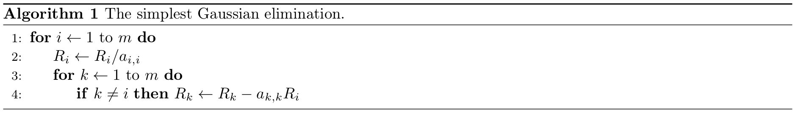

<script>
  document.getElementById("page-link-Linear Algebra").classList.add("active")
</script>

<p class="message">
The full version of this write-up was written in collaboration with another TEAMster Zehai (Tony) Wen. Here I only extracted my part about programmatic Gaussian elimination. In the full version posted on the course website, there is another part by him about proving the uniqueness of the reduced row echelon form.
</p>

Let us recall the technique of Gaussian elimination you have learnt from your first week of lectures. Hopefully you have been applying it to lots of systems of linear equations! You may have noticed that this process can be fairly complex but mechanical and repetitive. In this write-up, I will introduce an algorithm that a computer can understand to help us perform this elimination automatically. You may have seen a Gaussian Algorithm presented in plain text in the textbook as well as some other variants. What you will see next might be a little different from those, but will likely better correspond to the technique presented in the lectures. 

From now on, we will use $$A$$ to denote the matrix we are reducing, $$R_i$$ to denote the entire $$i$$-th row, and $$a_{i, j}$$ to denote the element on the $$i$$-th row and $$j$$-th column of the matrix. The matrix has $$m$$ rows and $$n$$ columns, where indices start from $$1$$ to $$m$$ or $$n$$, and the $$n$$-th column is the augmented part. Namely, we would like to reduce a matrix

$$ A = \left[ \begin{array}{cccc|c} 
a_{1, 1} & a_{1, 2} & \cdots & a_{1, n-1} & a_{1, n} \\
a_{2, 1} & a_{2, 2} & \cdots & a_{2, n-1} & a_{2, n} \\
\vdots & \vdots & \ddots & \vdots & \vdots \\
a_{m, 1} & a_{m, 2} & \cdots & a_{m, n-1} & a_{m, n}
\end{array} \right] 
\begin{array}{c}
    \leftarrow R_1 \\
    \leftarrow R_2 \\
    \vdots \\
    \leftarrow R_m
\end{array}.$$

Let us start illustrating with a simple example. We will reduce:

$$ A = \left[ \begin{array}{cc|c} 
2 & 3 & 5 \\
1 & 0 & 1
\end{array} \right]. $$

For us, it is very tempting to first swap the two rows. However, it is actually fairly difficult to train a computer so that it can recognize this nice shortcut! So for our algorithm, we will force it to go for a more convoluted but general way, namely starting from the first row (remember that we will reach the same result anyway).

Then what shall we do first? We want a leading one at $$a_{1, 1}$$, so we divide everything on row 1 by 2 to obtain the next state of the matrix

$$ A = \left[ \begin{array}{cc|c} 
1 & 1.5 & 2.5 \\
1 & 0 & 1
\end{array} \right]. $$

So, in general, **if you want to produce a leading one at the $$j$$-th column of the $$i$$-th row, you divide everything on row $$i$$ by the current $$A_{i, j}$$**. For simplicity, we will denote this entire operation in the pseudo code by: 

$$ \boxed{R_i \leftarrow R_i / a_{i, j}}. $$

Next, we wish to get rid of everything else on column 1 other than the leading one on the first row. For this, we subtract the first row from the second to get

$$ A = \left[ \begin{array}{cc|c} 
1 & 1.5 & 2.5 \\
0 & -1.5 & -1.5
\end{array} \right]. $$

In general, to get rid of the element at column $$j$$ of row $$k$$ (where $$k$$ iterates from $$1$$ to $$m$$ except $$i$$ to cover every other row), **we subtract $$a_{k, j}$$ times the $$i$$-th row ($$R_i$$) from the $$k$$-th row ($$R_k$$)**, namely

$$\boxed{\text{For all } 1 \leq k \leq m \text{ and } k \neq i\text{, do } R_k \leftarrow R_k - a_{k, j} R_i}.$$

Now that we are done with the first column, we perform similar operations to the second column. First divide everything on column 2 by $$a_{2, 2} = -1.5$$ (i.e., $$R_2 \leftarrow R_2 / a_{2, 2}$$) to get $$\left[ \begin{array}{cc\|c} 1 & 1.5 & 2.5 \\ 0 & 1 & 1 \end{array} \right]$$, and then subtract $$a_{1, 2} = 1.5$$ times the second row from the first row (i.e., $$R_1 \leftarrow R_1 - a_{1, 2}R_2$$) to get the final result

$$ A = \left[ \begin{array}{cc|c} 
1 & 0 & 1 \\
0 & 1 & 1
\end{array} \right]. $$

Notice again that we do not simply cancel the $$1.5$$ on the first row with the $$-1.5$$ on the second—the computer is not smart enough to recognize it itself!

Now, we have had a promising algorithm for the simplest type of Gaussian elimination, namely for $$m$$ equations with $$n=m$$ unknowns and one single solution. Notice that in such a case, on any row $$i$$, we always want a leading one at column $$j=i$$, so in the pseudo code for this case below, I will replace all $$j$$'s by $$i$$'s.



This algorithm looks okay but actually has some problems with some cases, which you may have noticed. Don't worry, we will fix them gradually along the way.

Next, we will turn to a more general case, where there could be free variables. In such a case, **the leading variable on row $$i$$ is not necessarily on the $$i$$-th column anymore**. We will instead maintain a variable $$j$$ that records the column we are currently dealing with, so that we can skip a column if it is impossible to obtain a leading 1 there.

But how would we know on what column the next leading variable would be? Let us consider the following example:

$$ A = \left[ \begin{array}{cccc|c} 
1 & 2 & 0 & 2 & 1 \\
0 & 0 & 0 & 1 & 2
\end{array} \right]. $$

Notice that when we reach the second row, we need to skip column 2, which is 0, and also column 3, which is also 0, until we reach column 4. It appears that what we want to do is

$$\text{while } a_{i, j} = 0 \text{ do } j \leftarrow j + 1,$$

i.e., we keep incrementing $$j$$ until we hit a non-zero element.

However, this is not quite right. If we look at this example:

$$ A = \left[ \begin{array}{ccc|c} 
1 & 0 & 0 & 1 \\
0 & 0 & 1 & 2 \\
0 & 1 & 0 & 3
\end{array} \right]. $$

This is a perfectly valid case with one unique solution. But on the second row, our algorithm will skip the second column and think it is a free variable! This can be easily solved by swapping the second row with the third row, and this time, we can really come up with a clear way to teach the computer about this swapping, namely **if $$a_{i, j} = 0$$ and there exists another row $$k$$ below ($$k > i$$) such that $$a_{k, j} \neq 0$$, we will swap row $$i$$ and row $$k$$ so that we can continue to generate a leading 1 at the $$j$$-th column on the new row $$i$$; but if there does not exist such a row $$k$$, it is not possible to get a leading 1 on column $$j$$ and we will increment $$j$$ and try the next column**.

So now, we can have a rough pseudo code of the Gaussian elimination, as below. Note that on any line, the words after `//` are comments and are not executed anyhow.


Note that we left out some details about some nested loops that check the existence of nonzero elements below and perform row operations (scaling, swapping, subtracting, etc.) as some logic there can be confusing if you are not yet familiar with programming. If you are interested in the full details and are fairly familiar with programming, I would invite you to write it out in any programming language you are comfortable with, which could be a great exercise for both your linear algebra and programming skills! Below is a piece of code I wrote in Java as practice when taking MATH 133 (while at the same time learning Java at [ECSE 202 Introduction to Software Development](https://mcgill.ca/study/2019-2020/courses/ecse-202)) back in Fall 2019. Note that some variable names and notations are different from what we did in the pseudo code, and in computer programs, indices usually start with 0.

```
public static void eliminate(int m, int n, double matrix[][]) {
		
	for(int i = 0, j = 0; i < m && j < n - 1; ++i, ++j) {
			
		while(j < n - 1) {
			boolean leadingVar = true; // a flag that tells whether it is possible to have a leading variable on column j
			if (Math.abs(matrix[i][j]) <= 1e-5) { // Floating point numbers can be a bit off in computers, so a 0 is not necessarily exactly 0 internally. This is a common trick: checking whether its absolute value is below 10^-5 instead of whether it is not strictly equal to 0
				leadingVar = false;
				for (int k = i + 1; k < m; ++k) {
					if (Math.abs(matrix[k][j]) >= 1e-5) { // found a good row to swap
						leadingVar = true;
						for (int l = 0; l < n; ++l) { // swap rows i and k, one elemnet at a time
							double tmp = matrix[i][l];
							matrix[i][l] = matrix[k][l];
							matrix[k][l] = tmp;
						}
						break; // no need to see other rows below
					}
				}
			}
			if (leadingVar) { // Done with finding the leading variable for row i
				break;
			} else { // Free variable on column j, skip and continue trying
				++j;
			}
		}
		if(j == n - 1) break; // Reached the rightmost, we are done with the matrix
			
		// Divide the whole row to get leading 1
		double div = matrix[i][j];
		for(int k = 0; k < n; ++k) matrix[i][k] /= div;
			
		// Get rid of other non-zero elements on the same column
		for(int k = 0; k < m; ++k) {
			if(k == i) continue;
			double mult = matrix[k][j];
			for(int l = 0; l < n; ++l)
				matrix[k][l] -= matrix[i][l] * mult;
		}
			
    }
}
```