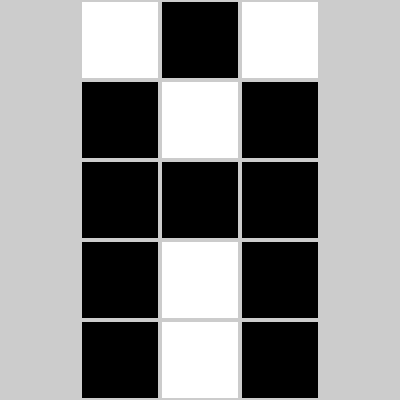
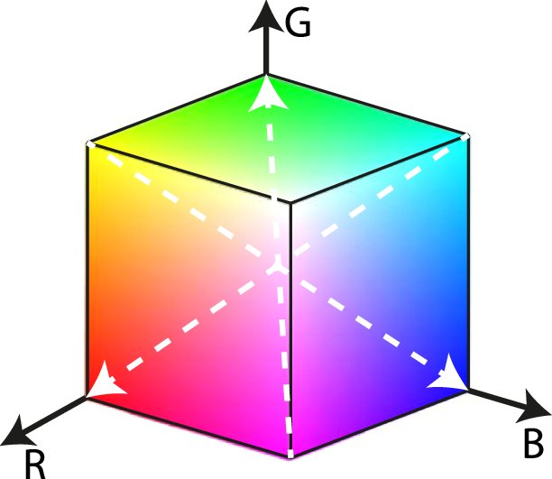
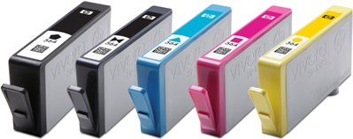

## Introduction

Linear algebra plays an essential role in computer graphics. Now that you have seen the concepts of vector spaces and linear transformations, in this write-up, we will have a look at the ways images are represented in computers and have a rough sense of how linear algebra comes into play. Don't worry, I will not assume you have any more advanced knowledge than what you have seen in this course so far!

## Encoding of Images and Colours

### About Pixels

As you may have heard of, a screen has a lot of what is called *pixels*. The word *pixel* stands for "picture element" [1]. You can think of a pixel on a screen as a tiny grid on a huge chessboard. A typical 1080p display has 1920 such grids on each row (left to right) and 1080 such grids on each column (top to bottom), which is often denoted as a *resolution* of $$1920 \times 1080$$. My 4K monitor has $$3840 \times 2160$$ pixels, which has twice as many pixels a 1080p alternative has on each dimension. The newly released iPhone 13 technically has $$2532 \times 1170$$ pixels on its 6.1-inch display (which is not exactly right since "the display has rounded corners that follow a beautiful curved design" and these values are obtained if you measure them pretending the screen has a "standard rectangular shape", according to Apple's technical specifications). 

The more pixels you have in a given area, the clearer the image becomes. We often use the number of "pixels per inch" (ppi) to measure how many pixels there are in an one-inch area. Old displays often have a low ppi, so you will notice mosaics and the content will appear blurry. When iPhone 4 was released in 2010, Apple brought about the concept of the "Retina Display". The idea is that, when the resolution exceeds a magic number 300 ppi, we will not notice the pixels anymore with our naked eyes, but will see smooth and continuous shapes and tones.

The reason for this relationship between the density of pixels and the clarity of the display is that each individual pixel can only show one single colour across the entire grid, even if there is supposed to be a boundary of two colours within the area. The colour a pixel displays is controlled by a specific signal the computer will give according to what needs to be displayed on the screen. In order to properly communicate and display those colours, there are unified schemes to encode them, which we will see next.

### Colour Encoding Schemes

#### Black and White

The easiest way to encode an image is to make each pixel either black or white. By convention, 0 means white and 1 means black. Then, each pixel can be controlled by exactly one *binary* digit. Computer scientists likes binary because it can represent exactly the on/off status of, say, a switch. For example, on a low-resolution black-and-white screen, the letter "A" might look as follows:

{:.image-caption}
Figure 1: A $$3 \times 5$$ letter A [2]

Interestingly, we could actually think of it as a matrix $$\left[ \begin{matrix} 0 & 1 & 0 \\ 1 & 0 & 1 \\ 1 & 1 & 1 \\ 1 & 0 & 1 \\ 1 & 0 & 1 \end{matrix} \right]$$! In programming, we tend to use a data structure called "array".

#### Grayscale

A more refined way is to allow for a "gray" zone between the two extremes black and white, and this is called grayscale encoding. We commonly use 8 binary digits to allow for 256 possible integer values (0 to 255) going progressively from black to white. Then, each pixel on the screen, or each element in the array, could be an integer ranging from 0 to 255 instead of only 0 or 1.

#### RGB

If we want to allow for colours, there are different ways to do this, and RGB is a common one used in computers. The idea is to mix **r**ed, **g**reen, and **b**lue, which are the three primary colours of light in terms of optics, in different proportions to produce various colours. In computers, we commonly use 8 binary digits to allow for 256 possible integer values (0 to 255) to represent the portion of each element. Then, each pixel becomes a tuple $$(R, G, B)$$. Or, you can even think of it as a vector $$\left[ \begin{matrix} R \\ G \\ B \end{matrix} \right]$$! In fact, there is a concept called the "RGB colour space", which shows the range of colours that can be presented by different proportions of red, green, and blue.

{:.image-caption}
Figure 2: The RGB Colour Space Represented in Cartesian Coordinates [3]

Pop quiz: would you say this colour *space* is a *subspace* as defined in MATH 133?  Why or why not?

#### CMYK

Another colour encoding system, which is widely used for printing materials, is CMYK. Similar to RGB, it stands for four colours mixed: **c**yan, **m**agenta, **y**ellow, and **k**ey (black). And yes, this is exactly the four ink colours you may find in common household printers!

{:.image-caption}
Figure 3: A set of HP 862 Inkjet [4]

## Transformations

Now, let's imagine you have a coloured document on your computer and you wish to print it through uPrint on campus.

### RGB to Grayscale

You feel that it is way too expensive to print in colour, so you choose "uPrint_mono". Most likely, the document is encoded in RGB on your computer, and a transformation to grayscale will have to be made before you can get the paper copy.

How do we transform from RGB to grayscale? Note that $$(0, 0, 0)$$ is black and $$(255, 255, 255)$$ is white. So, generally, we want to make colours with higher RGB values closer to white and those with lower values closer to black. There are two simple approaches, as well as many others:

**Average method.** We can simply take the average of the three values. Namely, $$\text{Grayscale} = \frac{R + G + B}{3}$$ [5].

**Weighted method, or luminosity method.** This method weighs red, green, and blue according to their wavelengths so that the grayscale picture will look nicer. A common formula is $$\text{Grayscale}  = 0.299R + 0.587G + 0.114B$$ [5].

Now I have some questions for you to think of. Let's say the resulting grayscale value is $M$ and think of the RGB values as a vector $$\left[ \begin{matrix} R \\ G \\ B \end{matrix} \right]$$. Can you try to represent the two transformations above in terms of some matrices and vectors? Is this a linear transformation?

Furthermore, do you think this transformation can be "undone"? That is, if you have a greyscale code derived from some RGB code, can you figure out what the coloured image look like in RGB? Try to argue why or why not in an intuitive way. Also, what does this mean for the equation you had earlier? (Hint: Try to think of it as a system of linear equations.)

### RGB to CMYK

You feel the monochromatic document does not look well and still decide to print it in colour. This time, the printer will want to transform RGB to CMYK as it has the CMYK inkjets. There are again a lot of ways to do this, one of which is the following [6].

First, we scale the values of $$R$$, $$G$$, and $$B$$ as follows: $$R^\prime = \frac{R}{255}$$, $$G^\prime = \frac{G}{255}$$, and $$B^\prime = \frac{B}{255}$$.

Then, the values of $$C$$, $$M$$, $$Y$$, and $$K$$ can be calculatd as follows: $$K = 1 - \text{max}\{R^\prime, G^\prime, B^\prime\}$$, $$C = \frac{1 - R^\prime - K}{1 - K}$$, $$M = \frac{1 - G^\prime - K}{1 - K}$$, and $$Y = \frac{1 - B^\prime - K}{1 - K}$$.

Again, do you think this is a linear transformation?

Feel free to discuss about your thoughts and questions about all those questions I gave above in the thread where I posted this write-up on our course discussion board!

## Acknowledgements and Further References

I wish to thank our instructor Prof. Rosalie Bélanger-Rioux for this great idea about linear transformations for colour spaces, which inspired me to complete this write-up. Also, I would like to thank my instructor in [COMP 250 – Introduction to Computer Science](https://mcgill.ca/study/2019-2020/courses/comp-250), [Prof. Michael Langer](http://cim.mcgill.ca/~langer), for sharing his materials for [COMP 557 – Fundamentals of Computer Graphics](http://cim.mcgill.ca/~langer/557.html) and giving me advice through email for this write-up. He also suggested that "homogeneous coordinates and projective geometry [both of which have actually been covered in MATH 133 already] are particularly useful and common."

Of course, this write-up is far from exhaustive about the colour systems and computer graphics. If you are interested in those topics in computer graphics, feel free to take [COMP 557 – Fundamentals of Computer Graphics](https://mcgill.ca/study/2021-2022/courses/comp-557) or [ECSE 532 – Computer Graphics](https://mcgill.ca/study/2021-2022/courses/ecse-532) (which are actually the same course) in the future, check out materials on [Prof. Langer's website](http://www.cim.mcgill.ca/~langer/557.html), or explore anything else online!

## References

[1] M. Langer. "COMP 557 Lecture 1 – Preliminaries," 2015. [Online]. Available: <http://www.cim.mcgill.ca/~langer/557/1.pdf>.
    
[2] Code.org. "Encoding B&W Images," 2018. [Online]. Available: <https://curriculum.code.org/csp-18/unit2/3/>.
    
[3] A. Aguirre, M. K. Alarfaj, E. Li, J. F. Hernández-Sánchez, and S. Thoroddsen. "Tomographic Particle Image Velocimetry using Smartphones and Colored Shadows," *Scientific Reports*, vol. 7, no. 1, p. 3714, 2017. doi: 10.1038/s41598-017-03722-9.
    
[4] HP. "HP Inkjet Supplies – HP 862 Ink Cartridge Specifications." [Online]. Available: <https://support.hp.com/za-en/document/c01588839>.
    
[5] Dynamsoft. "Image Processing 101 Chapter 1.3: Color Space Conversion," 2019. [Online]. Available: <https://www.dynamsoft.com/blog/insights/image-processing/image-processing-101-color-space-conversion/>.
    
[6] RapidTables. "RGB to CMYK conversion." [Online]. Available: <https://www.rapidtables.com/convert/color/rgb-to-cmyk.html>.